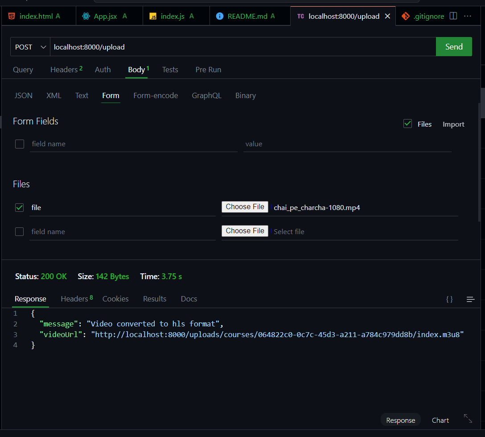

## This is a video streaming poc

The basic undersatanding of how video streaming works

bla bla bla ....

## First go to the index js => backend

## fontend is basic => in fonted folder

# used ffmpeg

one of the crazy library
,, also how the `hls` works

api => loacalhost:8000/upload => body:{ file : => that file}

it will return a m3u8 file

# M3U8

these are the files that actuvally are the segments of a video , i.e

the complete video is divided into chunks and and actuvally these chuks are transferred accordingly and setup in realtime with the client , thses chucks will be based on 240,1080,720p which ever is necessary

are used the `exec` from the `child_process` be careful when u use this

so this is what i have learnt and also how multer works , multer ais a good middleware but in the sense , normally we don't store videos on the backend server, they are usally dumped in `S3` , and on the `S3` we use the `Cdn`so this is how it is built.. 

## ffmpeg

the command used from ffmpeg that divided these videos into chunks and its explanation

`ffmpeg -i ${videoPath} -codec:v libx264 -codec:a aac -hls_time 10 -hls_playlist_type vod -hls_segment_filename "${outputPath}/segment%03d.ts" -start_number 0 ${hlsPath}`

The whole magic happens in the ffmpegCommand variable. It contains the command to convert the video to HLS format using ffmpeg. The -codec:v and -codec:a options specify the video and audio codecs to use, respectively. The -hls_time option sets the time between each HLS segment, and the -hls_playlist_type vod option specifies that the HLS playlist is a VOD (Variable Bitrate) playlist. The -hls_segment_filename option specifies the filename pattern for each HLS segment, and the -start_number 0 option starts the segment numbering at 0. Finally, the ${hlsPath} variable is used to construct the full path to the HLS playlist file.

## video streaming client in React => video.js

https://videojs.com/

we acuvally send the m3u8 file to this and it works sexyy ,,..

this is the reponse you get 

## Stating
backend => npm start

frontend => cd fontent && npm run dev

this is not to be used in the production only for the knowledge purpose and the understanding of how it actuvally works
